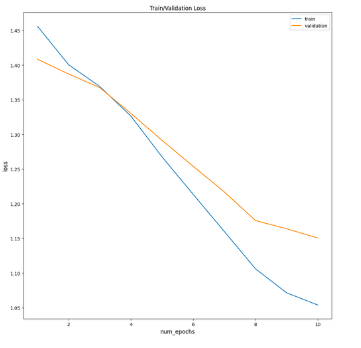

# Building a Review classification model using LSTM with use of PyTorch 

## Project Description 
The purpose of this project is to build a review classification model, that does sentiment analysis of the review content from an application which is scaled in the rage of 1 to 5. The deep learning model was built using LSTM (Long Short Term Memory) which is a variant of RNN ( Recurrent Neural Network). The model is trained on the review data and their properties to predict the sentiment, using PyTorch.This project outlines an automated model pipeline which can be used to evaluate and validate the model's performance.

## Background 
Due to the vainishing gradient problem during the backpropogation, the traditional RNNs become ineffective in capturing long-term dependencies in long textual sequences.LSTMS have a gating mechanism which uses three gates called input, forget and output to control the flow of information between layers.Forget gate determines which information from previous cell state to discard, input gate determines the new information added to the current cell state and ouput gate process previous hidden states and current cell state to determie which information to output in the current cell state. These gates in the LSTM architecture helps maintain long term dependencies and adress the vanishing gradient problem and work effectively in sequential text sentimental analysis.

## Objective 
The primary goal of this project is to build an automated pipeline that preprocess textual data, builds a predictive model using pyTorch module, evaluate and validate the performance of the model. This workflow allows for batch processing of extensive text datasets using PyTorch's library, and it evaluates the training and validation loss of the developed model to help identify areas for improvement before deploying it in a production environment.

## Data 
The  raw information collected from users as  shown in the [review dataset](Data/review_data.csv)  is processed to extract the necessary columns for model building in this project, specifically `content` and `score`, which respectively represent the review text and the rating given by the user based on their review. The `score` which is the target column in this project is a categorical variable that contains values between 0-5, reflecting the sentiment expressed in the review.

## Model pipeline 

1. Preprocessing the dataset:
- Clean the text data by removing stopwords and stemming text to ensure an appropriate format.
- Resampling the target variable if an imbalanced data distribution is found.
- Encode categorical labels to numerical values which is in the compatible format for machine learning algorithms.
2. Tokenization
  - Generate word tokens.
  - Generate word index.
3. Create dataset:
- Split the dataset to train, validation and test sets.
- Convert dataset to Torch Datasets and initialize torch DataLoaders for batches of the dataset.
4. Model building using PyTorch library.
5. Model Training & Evaluation:
  - Train the model on the training split for a predetermined number of epochs.
  - calculate and compare the training loss and validation loss of the model.
  - Evalute the model's performance accuracy using the validation split.

### Preprocessing the Dataset

The [**clean_text(self,data)**](MLPipeline/Preprocessing.py) method of the **Preprocessing** class shows a sequence of steps utilized to clean the textual data. It has filtered the common words (which don't carry significant information helpful for sentiment analysis)  of the review text data using the stopwords downloaded from NLTK library's corpus. The filtered review text data were then stemmed using the NLTK's PorterStemmer method.

Different variations of the same word would introduce noise to the model, thus they should be standardized to improve the model accuracy.Stemming is the process of simplifying the words to their base form by removing or replacing suffixes which is computationally morer efficient compared to lemmatization process which does the same function but involves more morphological analysis of the textual data. In this project for faster preprocessing of textual data stemming technique is implemented as the end goal is to build an automated pipeline to evaluate the model's performance accuracy.

During exploratory data analysis it was found the data distribution of the categorical labels of the dataset's target variable `score` didn't show a uniform distribution. To avoid introducing a  bias during the model training due to this imbalanced dataset, it is resampled using the resample method of the sklearn.utils module.
To wrap up the preprocessing phase,the categorical labels of `score` column was enconded to numerical values using the LabelEncoder method of the sklearn.preprocessing module.

### Tokenization 
While deep learning model is built using pyTorch library for its flexible model-building capabilities,Tensorflow is utilized for word tokenization of the textual data.Tensorflow's static computation graphs optimize the tokenization process and including its other preprocessing tools for lammetization and stemming are designed highly scalable for large datasets.

Machine learning algorithms expect textual data as a numerical input, to facillitate the model to extract features from text data and enable model to learn patterns and relationships between words. Assigning unique indices to words ensures consistent numerical representation throughout the dataset, enabling efficient storage and retrieval of text data, which is essential for handling large datasets.

As shown in the [**generate_tokens(self,data)**](MLPipeline/Tokenization.py) method of the **Tokenization** class, the method returned the tokenized content tetxtual data of the preprocessed dataset and numerical index for each unique tokens. It has used **vocabular_size= 2000** as the maximum unique words from the vocabulary and **input_length =600** as the maximum length of the input text sequence.It ensures consistency in the input sequences by truncating longer sequences and padding shorter ones to match the specified **input_length** of the word sequences.

### Create Dataset
The **[Create](MLPipeline/Create.py)** class uses two methods: **create_dataset** and **data_loader**, to transform the tokenized data into a format that facilitates efficient loading and processing for model training.The **create_dataset(self,X,Y)** method splits the input data into training, validation, and test sets and returns each split when the tokenized X data and label-encoded Y data are provided.

The **data_loader()** method converts these datasets into PyTorch tensors and creates TensorDataset objects for the training and validation sets.The torch tensors created from the X and Y sets of each split are in int64 format to preserve the original datatype of the dataset.Hence pyTorch enables using GPU to accelerate training and inference of the model, if the data needs to be moved to GPU, *cuda()* method from cuda toolkit should be used to move the torch tensors to GPU once torch tensors are created. **data_loader()** method then initializes DataLoader objects for both sets, with the training DataLoader shuffling the data to enhance generalization and avoid bias, and the validation DataLoader not shuffling the data to maintain consistency during epoch evaluations. This setup efficiently prepares and loads batch data for training and validating a PyTorch model.

### Model Building 
The **LSTM** class of the  [LSTM-based neural network model](MLPipeline/LSTM.py)  provides a structured blueprint that outlines the model architecture, detailing the initialization of various layers and the sequence of data flow through these layers. The LSTM class inherits from **torch.nn.Module** and initializes with an embedding layer, two LSTM layers, a dropout layer, a linear layer, and a softmax activation function. The**hidden_dim** variable represents the number of units in a hidden layer. It is a dynamic variable which keeps changing its value during each layer in the LSTM architecture.So that, the **hidden_dim** is stored as an instance variable, ensuring that its value is consistently accessible and can be referenced or modified as needed throughout the class.Other parameters like **vocab_size**, **embedding_dim** which is size of word's vector representation, and the dimensions for the linear layer are directly passed to the respective layers during initialization and are not stored as instance variables because they are typically used only once during the setup of those layers.

The **forward ()** method processes the input data through these layers, embedding the input tokens, passing them through the LSTM layers, applying dropout, and finally using a linear layer followed by softmax to produce the output probabilities for each class. The model is designed to handle padded sequences and outputs class probabilities for a 5-class classification problem by using softmax activation and 5 outputs in the output Linear layer.

## Model Training & Evaluation

The [Training](MLPipeline/Training_validation.py) class uses two methods : **train_val()** and **evaluation()** to handle the training process over a specified number of epochs, utilizing a cross-entropy loss function which is apprpriate for multi-class classification and the Adam optimizer, followed by simaltaneously calculating the training loss and  validation loss during each epoch to asses the model's performance. 

To begin the training phase, model is configured to train mode and initial average loss for each epoch was set to zero. Then it iterates through batches (batch_size=50) of training data, computes  the loss, performs backpropagation to calculate the gradient of the loss function, and updates the model parameters. The optimizer's gradient is set to zero at the beginning of each training iteration to ensure it doesn't retain any past gradient values from previous iterations.The average training loss is calculated at the end of each iteration and appended to the train_loss list. This list is then used for evaluating the model's performance over time, helping to track improvements and identify any potential issues during the training process.

The evaluation method is responsible for evaluating the model's performance on validation data, calculating the average validation loss, storing predictions, and determining validation accuracy. The evaulation method begins by configuring the model to evaluation mode.

Both methods include provisions for moving computations to a GPU for faster processing. The output results, including training and validation losses, accuracy, and elapsed time, are printed at the end of each epoch.

The above plot is obtained by tracking the training and validation loss for 10 epochs. 

The training loss indicates how well the model is learning from the training data while validation loss evaluates the model's performance on unseen data which helps in assessing the model's ability to generalize to new data. A decreasing trends in both training and validation losses indicates the model is effectively learning the patterns in the training data and also generalizing well to new, unseen data.

